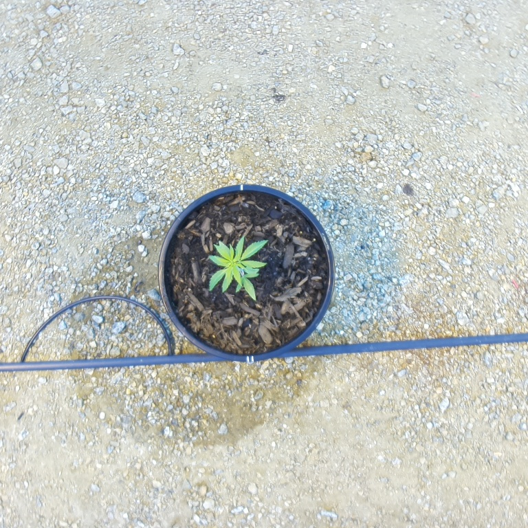
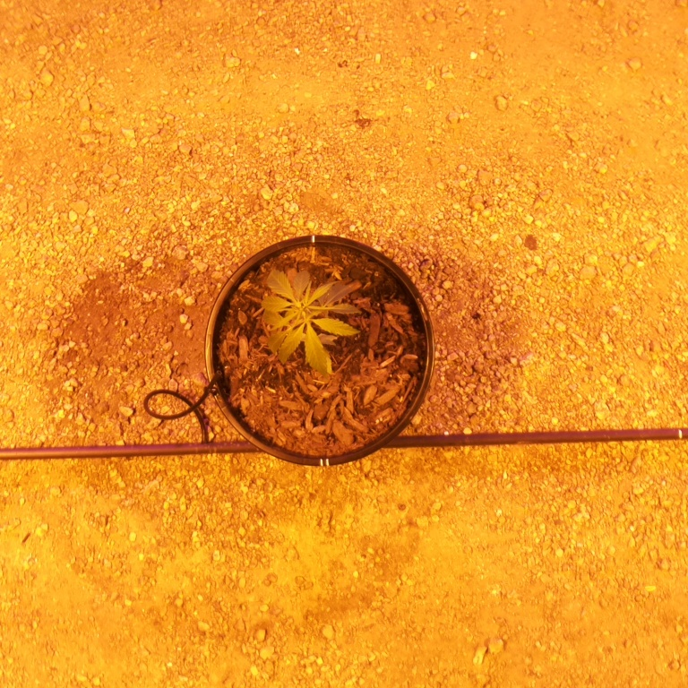
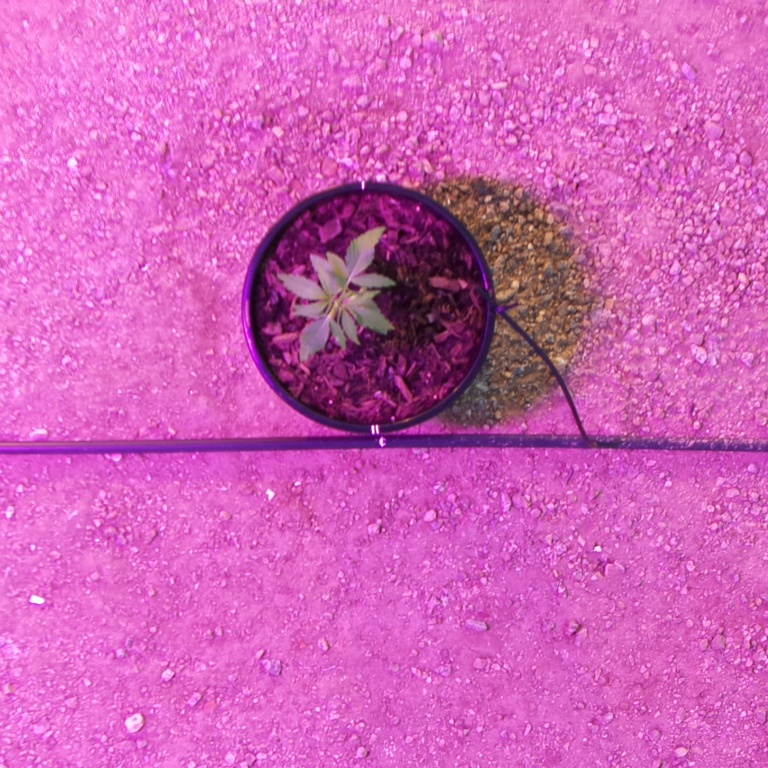
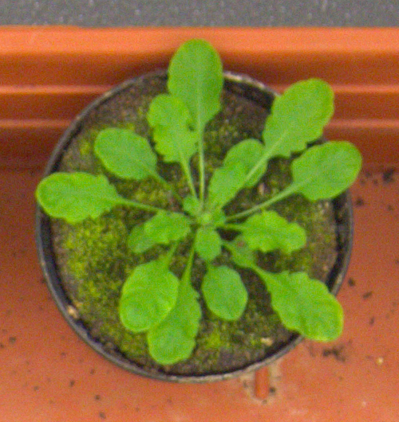
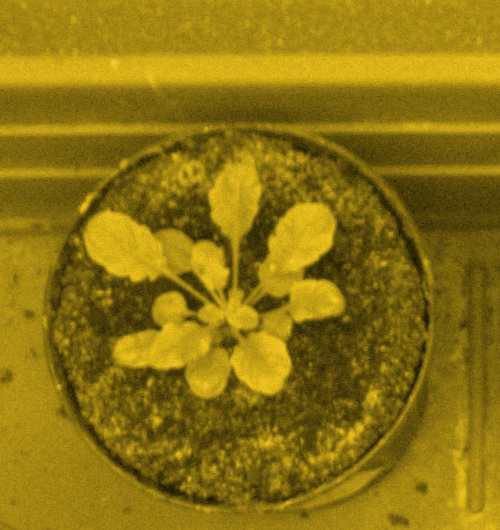
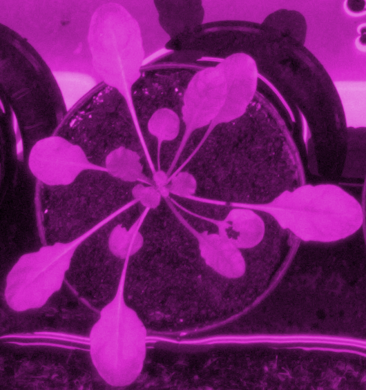
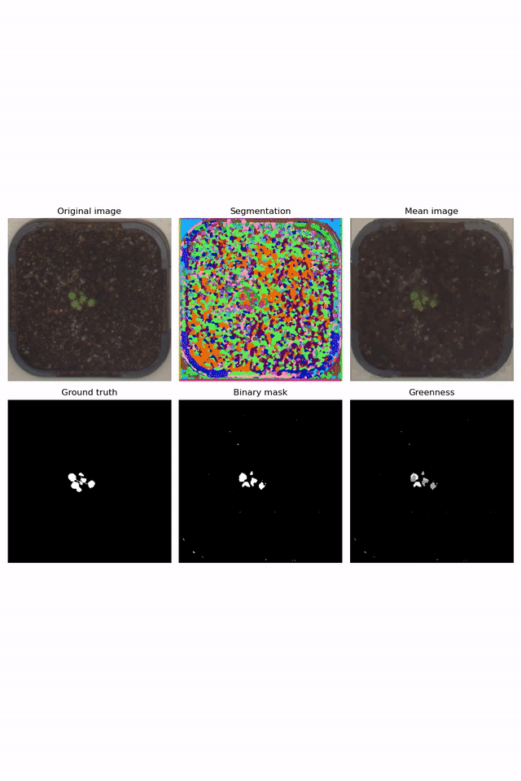
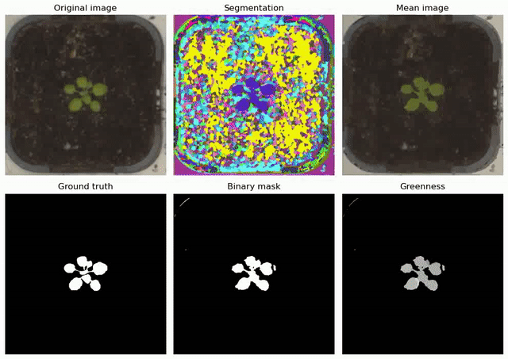
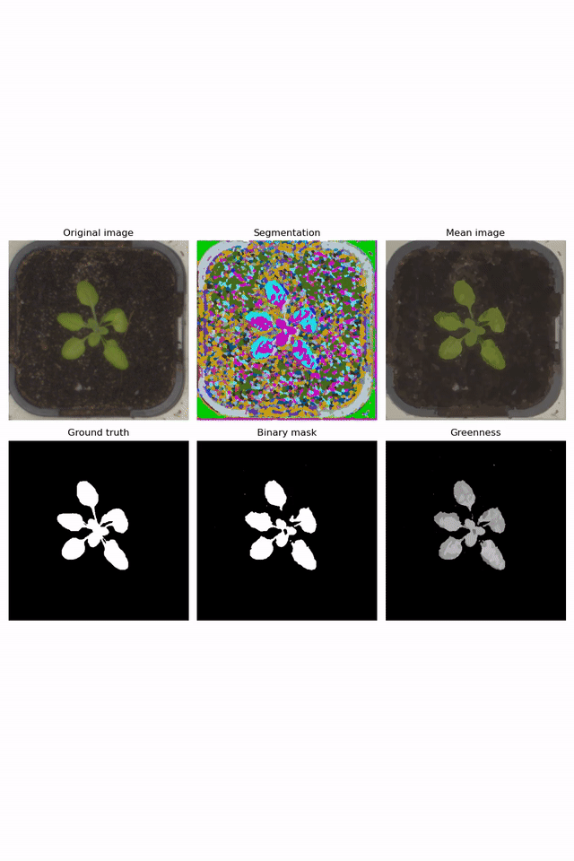

# Self-supervised-leaf-segmentation
## Introduction
This repository contains the code for *Self-supervised Leaf Segmentation Under Complex Lighting Conditions*. Intended for growth monitoring in a real-world cannabis greenhouse, this project leverages self-supervised learning for effective and generalizable leaf segmentation in images taken under artificial grow lights, without resorting to any annotated data.
## Datasets
We use two datasets in our experiments: **Our Cannabis dataset** and the **CVPPP leaf segmentation challenge (LSC) dataset**. These two datasets are available [here](https://drive.google.com/drive/folders/1tmaRUmdnDhyvnznOWD_S1sYkxb-g02MT?usp=sharing){:target="_blank"}.

Our Cannabis dataset contains 120 images captured under three different lighting conditions: "Natural", "Yellow", and "Purple", with 40 images obtained in each lighting condition. 

Cannabis "Natural"             | Cannabis "Yellow"         | Cannabis "Purple"
:-------------------------:|:-------------------------:|:-------------------------:
  |    |.  

To simulate the "Yellow" and "Purple" lighting conditions for the CVPPP dataset, we generate the "Yellow" and "Purple" versions of each image by manipulating the hue value of each pixel. The original CVPPP LSC dataset is refered to as "Natural".

CVPPP LSC "Natural"             | CVPPP LSC "Yellow"         | CVPPP LSC "Purple"
:-------------------------:|:-------------------------:|:-------------------------:
  |    |.  

## Demos
### Cannabis leaves
  
### Small-sized leaves in the CVPPP LSC dataset
 
### Medium-sized leaves in the CVPPP LSC dataset
 
### Large-sized leaves in the CVPPP LSC dataset
 
