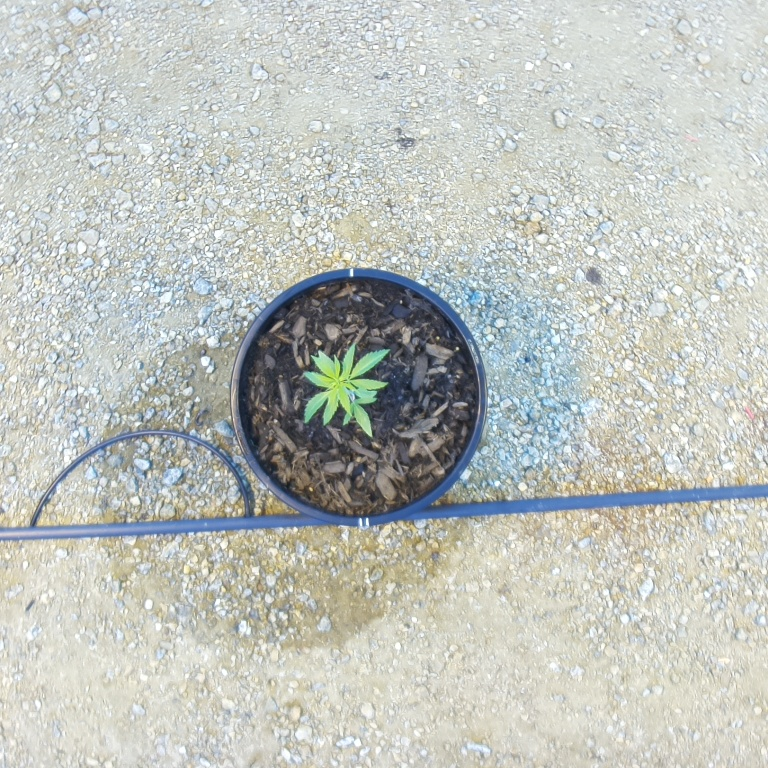
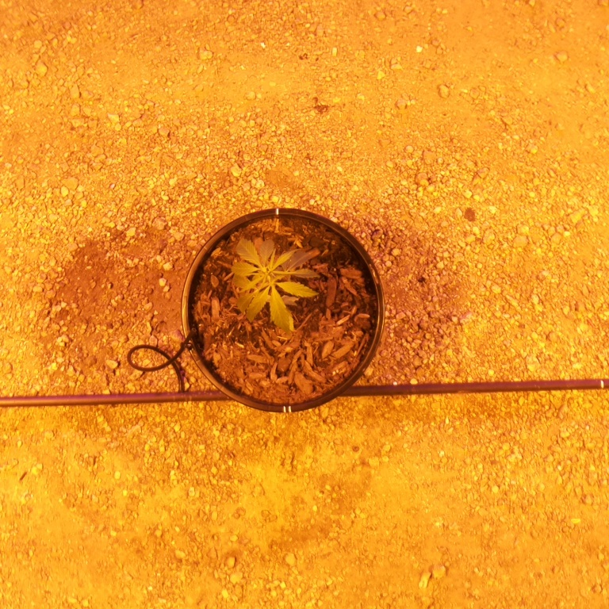
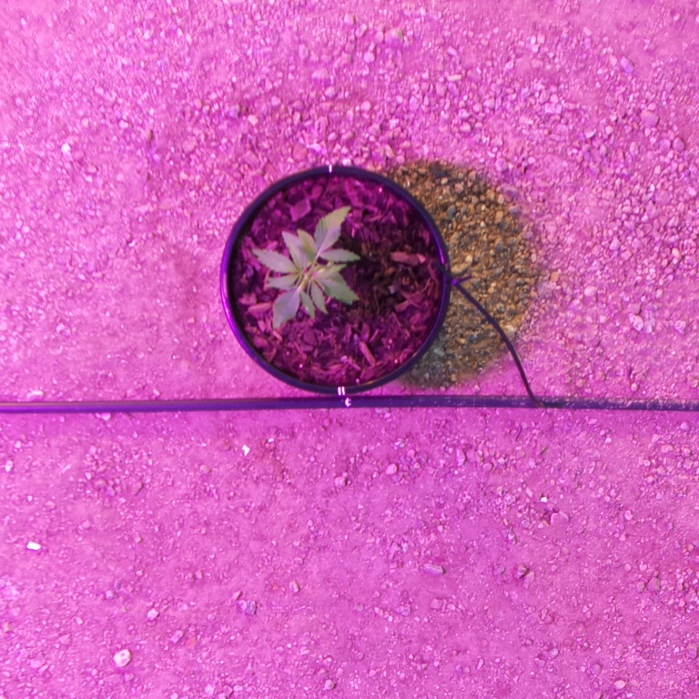
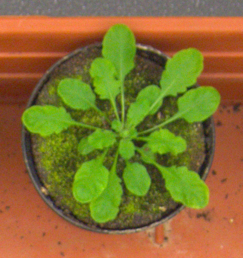
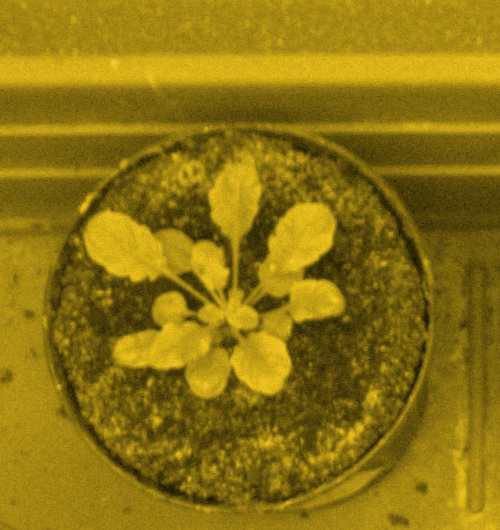
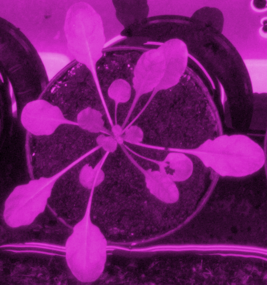
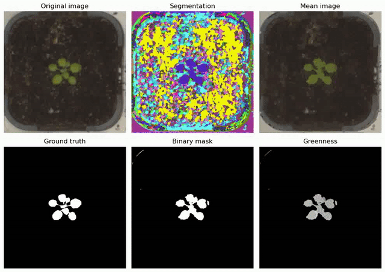
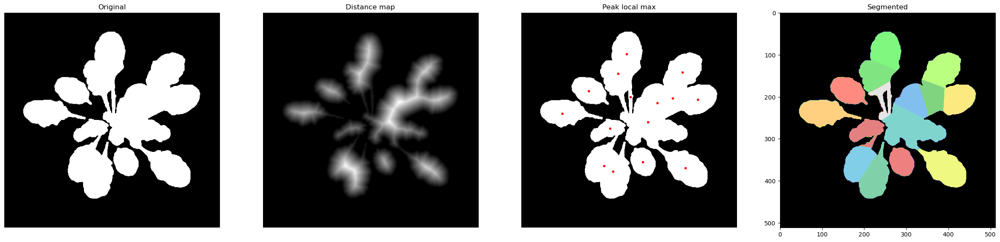

# Self-supervised Leaf Segmentation Under Complex Lighting Conditions
## Introduction
This repository contains the code for [*Self-supervised Leaf Segmentation Under Complex Lighting Conditions*](https://www.sciencedirect.com/science/article/abs/pii/S0031320322005015). Intended for growth monitoring in a real-world smart greenhouse environment, this project leverages self-supervised learning for effective and generalizable leaf segmentation in images taken under artificial grow lights, without resorting to any annotated data. If you find this work useful, please cite our paper:
```
@article{lin2022self,
  title={Self-Supervised Leaf Segmentation under Complex Lighting Conditions},
  author={Lin, Xufeng and Li, Chang-Tsun and Adams, Scott and Kouzani, Abbas and others},
  journal={Pattern Recognition},
  pages={109021},
  year={2022},
  publisher={Elsevier}
}
```
## Datasets
We use two datasets in our experiments: **Our Cannabis dataset** and the **CVPPP leaf segmentation challenge (LSC) dataset**. 
These two datasets and the pretained color correction models can be downloaded <a href="https://drive.google.com/drive/folders/1tmaRUmdnDhyvnznOWD_S1sYkxb-g02MT?usp=sharing" target="_blank">here</a>. Put the downloaded 'pretrained' folder in the root directory of the source code (i.e., at the same level as folders 'imgs', 'exmaples' and 'output').

Our Cannabis dataset contains 120 images captured under three different lighting conditions: "Natural", "Yellow", and "Purple", with 40 images obtained in each lighting condition. 

Cannabis "Natural"             | Cannabis "Yellow"         | Cannabis "Purple"
:-------------------------:|:-------------------------:|:-------------------------:
  |    |.  

To simulate the "Yellow" and "Purple" lighting conditions for the CVPPP dataset, we generate the "Yellow" and "Purple" versions of each image by manipulating the hue value of each pixel. The original CVPPP LSC dataset is refered to as "Natural".

CVPPP LSC "Natural"             | CVPPP LSC "Yellow"         | CVPPP LSC "Purple"
:-------------------------:|:-------------------------:|:-------------------------:
  |    |.  
## Instructions
The code was only tested on Ubuntu 20.04 with an NVIDIA GeForce RTX 2080 Ti. To get started, make sure the dependencies are installed via Anaconda:
```
# create and activate environment
conda env create -f ssls.yml
conda activate ssls
```
Once the environment has been activated, you should be able to run the below examples:

1. If you want to segment the leaves in the image './imgs/2021_06_30_23_rgb.png', run 
```
python leaf_segmenter.py --input ./imgs/2021_06_30_23_rgb.png
```
The output will be saved in './output/result.jpg'. By default, the final leaf segmentation result will be stored as an image showing the results of self-supervised semantic segmentation, mean image, absolution greenness, relative greenness, and the final binary segmentation result. 

2. If you would like to generate a video showing all the intermediate results, run 
```
python leaf_segmenter.py --input ./imgs/2021_06_30_23_rgb.png --save_video
``` 
The resultant video will be saved in './output/result.mp4'. 

3. For images taken under unnatural lighting conditions, you might want to apply color correction before leaf segmentation. The pretrained color correction models for the subsets (A1, A2, A3 and A4) of the CVPPP LSC dataset and our Cannabis dataset have been provided in folder 'pretrained'. Use the parameter '--ccm'  to specify the color correction model path for color correction. For example, if you want to correct the color for './imgs/2021_06_30_20_rgb.png' before segmentation, run 
```
python leaf_segmenter.py --input ./imgs/2021_06_30_20_rgb.png --ccm ./pretrained/Cannabis_ccm.pt
```
The color-corrected image will be saved in './output/color_corrected.jpg'. **For the best color correction performance, please specify the correct color correction model for a given image. **

4. There are various parameters you can control to generate the desired results. For more information, please run 
```
python leaf_segmenter.py --help
```
## Results
* ### Cannabis leaves
  
* ### Small-sized leaves in the CVPPP LSC dataset
 
* ### Medium-sized leaves in the CVPPP LSC dataset
 
* ### Large-sized leaves in the CVPPP LSC dataset
 
* ### Instance segmentation based on the binary leaf mask using distance map


## Acknowledgement
Thanks to the following projects that form the backbone of this repository:
* #### [**Fully Connected CRF**](https://github.com/lucasb-eyer/pydensecrf)
* #### [**Convolutional CRF**](https://github.com/MarvinTeichmann/ConvCRF)
* #### [**Image Colorization**](https://colab.research.google.com/github/smartgeometry-ucl/dl4g/blob/master/colorization.ipynb)
* #### [**Image-to-Image Translation**](https://github.com/phillipi/pix2pix)
* #### [**unsupervised-segmentationp**](https://github.com/kanezaki/pytorch-unsupervised-segmentation)

